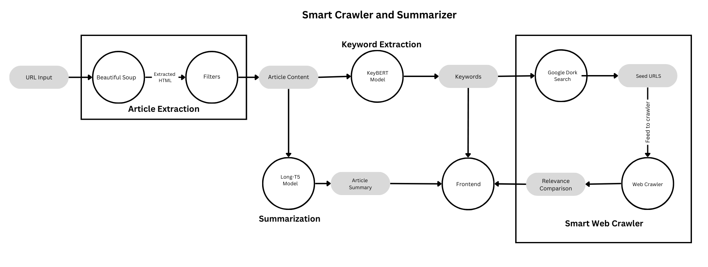

# Smart Crawler and Summarizer

[](https://opensource.org/licenses/MIT)
[](https://www.python.org/downloads/)
<!-- Add other relevant badges here, e.g., build status, code coverage -->

A powerful tool combining a Chrome Extension frontend with a Flask server backend to intelligently crawl related web pages and summarize web articles. It addresses information overload by providing concise summaries and discovering relevant content based on keywords extracted from the source article.

Built with **Flask**, **aiohttp**, **BeautifulSoup**, **KeyBERT**, **Hugging Face Transformers (Long-T5)**, and **scikit-learn**.

## Workflow

The diagram below illustrates the core process flow from receiving a URL to generating summaries and relevant links:


<!-- **IMPORTANT:** Upload your workflow diagram image (e.g., "workflow-diagram.png") to your GitHub repository and make sure this path is correct. You might place it in an `assets/` folder and update the path accordingly (e.g., ./assets/workflow-diagram.png) -->

**Flow Description:**

1.  **URL Input:** The process starts when the user provides a URL via the Chrome Extension.
2.  **Article Extraction:** The backend fetches the page content. `BeautifulSoup` parses the HTML, and custom filters attempt to isolate the main article content.
3.  **Summarization:** The extracted article content is fed into the **Long-T5** model (via Hugging Face `pipeline`) to generate a concise summary. Long content is automatically chunked for processing.
4.  **Keyword Extraction:** **KeyBERT** analyzes the article content to extract relevant keywords and keyphrases.
5.  **Seed URL Generation:** The extracted keywords are used to perform searches using `googlesearch-python` to find relevant starting points (seed URLs) for the crawler.
6.  **Smart Web Crawler:** The asynchronous crawler (`webCrawler.py`) starts with the seed URLs.
7.  **Relevance Comparison:** As the crawler visits pages, it extracts content and uses **TF-IDF** and **cosine similarity** (`scikit-learn`) to compare its relevance to the original article content. Only sufficiently relevant links are kept.
8.  **Frontend Display:** The generated summary, extracted keywords, and relevant links found by the crawler are sent back to the Chrome Extension for the user to view.

## Features

*   **Relevance-Based Web Crawling:**
    *   Asynchronously crawls web pages starting from Google Search results based on extracted keywords using `aiohttp`.
    *   Filters pages based on content similarity (TF-IDF & Cosine Similarity) to the original article, ensuring discovered links are relevant.
    *   Uses `BeautifulSoup` to parse HTML and extract meaningful text content, ignoring boilerplate like navbars and footers.
    *   Limits crawl depth and pages per domain to control scope and resources.
*   **Advanced Text Summarization:**
    *   Leverages a powerful Hugging Face **Long-T5** model (`pszemraj/long-t5-tglobal-base-16384-book-summary`), specifically designed for longer text inputs.
    *   Automatically chunks large articles based on tokenizer limits to fit model constraints.
    *   Utilizes **multiprocessing** (`concurrent.futures.ProcessPoolExecutor`) to summarize chunks in parallel for improved performance.
*   **Keyword Extraction:**
    *   Employs **KeyBERT** to identify the most significant keywords and phrases from the article content, driving the relevance search.
*   **Chrome Extension Interface:**
    *   Simple and intuitive UI within Chrome to trigger summarization and crawling for the currently active tab.
    *   Displays the summary, keywords, and discovered relevant links directly in the extension popup.
*   **Flask Backend:**
    *   Robust backend API built with Flask to handle requests from the Chrome extension.
    *   Serves the summarization, keyword extraction, and crawling functionalities.

## Technology Stack

*   **Backend:**
    *   **Framework:** Flask
    *   **Web Server:** Waitress (or Flask's development server)
    *   **Async HTTP:** aiohttp, aiohappyeyeballs, yarl
    *   **HTML Parsing:** BeautifulSoup4, soupsieve
*   **Frontend:**
    *   Chrome Extension (HTML, CSS, JavaScript)
*   **Machine Learning / NLP:**
    *   **Summarization:** Hugging Face Transformers (`pipeline`, `AutoTokenizer`, `torch`) - Long-T5 Model
    *   **Keyword Extraction:** KeyBERT, sentence-transformers
    *   **Relevance Scoring:** scikit-learn (`TfidfVectorizer`, `cosine_similarity`), NumPy, SciPy
    *   **Text Processing:** NLTK (tokenization, stopwords - *download may be required*)
*   **Core Libraries:**
    *   Requests
    *   googlesearch-python (*Note: Unofficial Google Search scraping*)
    *   Joblib, threadpoolctl (dependency for scikit-learn/numpy)

## Project Structure

```
Smart-Crawler-and-Summarizer/
│
├── chrome-extension/ # Frontend Chrome Extension files
│ ├── popup.html
│ ├── popup.js
│ ├── styles.css
│ ├── manifest.json
│ ├── background.js
│ ├── content.js
│ └── assets/
│
├── python-server/ # Backend Flask application
│ ├── server.py # Main Flask app, API endpoints
│ ├── webCrawler.py # Async relevance-based web crawler logic
│ ├── requirements.txt # Python dependencies
│ └── crawl_log.csv # Optional log file created by the server
│
├── .gitignore
└── README.md # This file
└── workflow-diagram.png 
```

## Installation

### Prerequisites

*   Python 3.8+
*   pip (Python package installer)
*   Google Chrome Browser

### Steps

1.  **Clone the repository:**
    ```bash
    git clone https://github.com/[YourGitHubUsername]/Smart-Crawler-and-Summarizer.git
    cd Smart-Crawler-and-Summarizer
    ```

2.  **Set up Python Virtual Environment (Recommended):**
    ```bash
    cd python-server
    python -m venv env
    # Activate the environment:
    # On Windows:
    # .\env\Scripts\activate
    # On macOS/Linux:
    # source env/bin/activate
    ```

3.  **Install Python dependencies:**
    ```bash
    # Ensure you are in the python-server directory with the virtual environment activated
    pip install -r requirements.txt
    ```

4.  **(Optional) Download NLTK Data:**
    The code currently has NLTK downloads commented out, but if you encounter errors related to `punkt` or `stopwords`, you might need to run this once in a Python interpreter:
    ```python
    import nltk
    nltk.download('punkt')
    nltk.download('stopwords')
    ```

5.  **Load the Chrome Extension:**
    *   Open Google Chrome.
    *   Go to `chrome://extensions/`.
    *   Enable **Developer mode** (usually a toggle in the top-right corner).
    *   Click on **Load unpacked**.
    *   Select the `chrome-extension` folder from the cloned repository.

## Usage

1.  **Run the Flask Server:**
    *   Navigate to the `python-server` directory in your terminal.
    *   Make sure your virtual environment is activated (if you created one).
    *   Start the server:
        ```bash
        python server.py
        ```
    *   The server will typically run on `http://127.0.0.1:5000`. Keep this terminal window open while using the extension.

2.  **Use the Chrome Extension:**
    *   Navigate to a web article you want to summarize or find related links for.
    *   Click the "Smart Crawler and Summarizer" extension icon in your Chrome toolbar.
    *   In the popup:
        *   Click **"Summarize Article"** to generate a summary of the current page.
        *   Click **"Get Relevant Links"** to extract keywords, search Google, and crawl for related pages.
        *   Click **"Generate Both"** to perform both actions.
    *   Loading spinners will indicate processing. The results (summary, keywords, links) will appear in the popup.

## Important Note on Google Search

This project uses the `googlesearch-python` library, which *scrapes* Google Search results. This method is unofficial and can be unreliable:

*   Google frequently changes its results page structure, which can break the scraping library.
*   Your server's IP address might get temporarily blocked or rate-limited by Google if it detects automated requests.

If the "Get Relevant Links" feature consistently fails to find seed URLs, consider:

*   Ensuring `googlesearch-python` is updated (`pip install --upgrade googlesearch-python`).
*   Implementing delays between search requests in `server.py`.
*   Switching to the official **Google Custom Search JSON API** (requires setup and has usage quotas/costs).

## Troubleshooting

*   **Extension Error: "Could not connect..."**: Ensure the Python Flask server (`python server.py`) is running in the background and accessible at `http://127.0.0.1:5000`. Check for any errors in the server terminal.
*   **No Relevant Links Found**: This could be due to the Google Search scraping issue mentioned above, or the crawler might not find pages meeting the similarity threshold within its limits. Check the server logs for details about keyword extraction and Google Search results.
*   **Slow Performance**: Summarization and crawling can be resource-intensive. Performance depends on the article length, website responsiveness, and your machine's capabilities.

## Contributing

Contributions are welcome! If you'd like to improve the Smart Crawler and Summarizer, please feel free to fork the repository, make changes, and submit a pull request. For major changes, please open an issue first to discuss what you would like to change.

1.  Fork the Project
2.  Create your Feature Branch (`git checkout -b feature/AmazingFeature`)
3.  Commit your Changes (`git commit -m 'Add some AmazingFeature'`)
4.  Push to the Branch (`git push origin feature/AmazingFeature`)
5.  Open a Pull Request

<!-- ## License -->

<!-- Distributed under the MIT License. See `LICENSE` file (if created) or the header badge for details. -->

<!-- You might want to add an Acknowledgements or Contact section -->